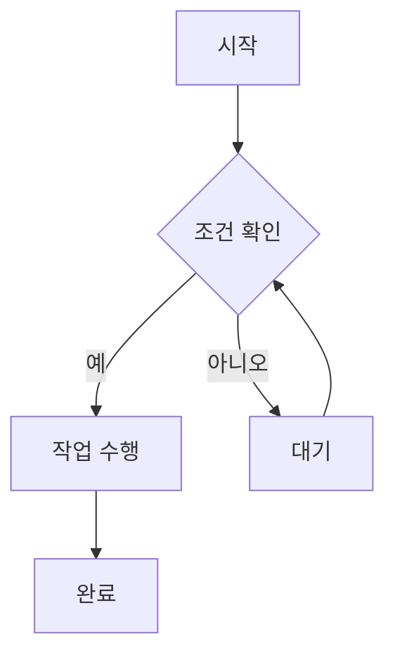
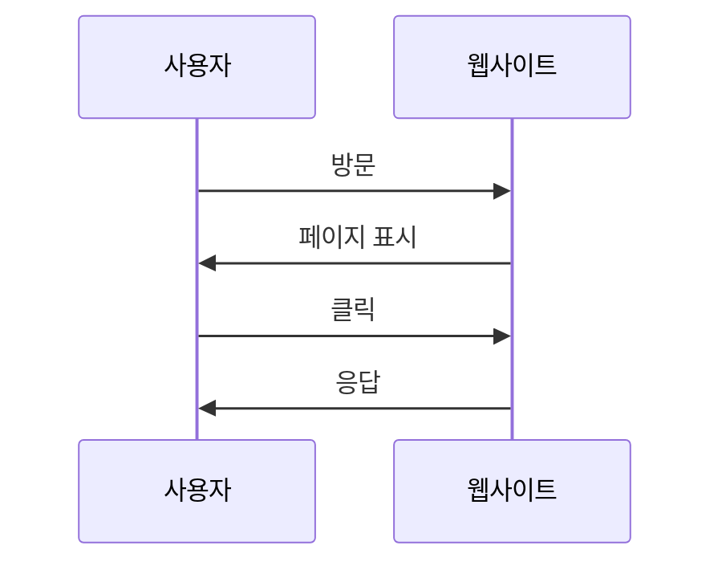

# 문서 작성 가이드

이 가이드에서는 MKDocs에서 사용할 수 있는 다양한 Markdown 기능과 Material 테마의 고급 기능들을 소개합니다.

## 📝 기본 Markdown

### 텍스트 서식

```markdown
**굵게 표시**
*기울임꼴*
~~취소선~~
`인라인 코드`
```

### 목록

```markdown
- 일반 리스트
  - 중첩 리스트

1. 번호가 있는 리스트
2. 두 번째 항목

- [ ] 체크박스 1
- [x] 체크박스 2
```

### 표

```markdown
| 이름 | 나이 | 직업 |
|------|------|------|
| 홍길동 | 25 | 개발자 |
| 이순신 | 30 | 디자이너 |
```

## 🎨 Material 테마 고급 기능

### 경고 상자 (Admonition)

```markdown
!!! note "주요 정보"
    이 내용은 중요한 정보입니다.

!!! warning "경고"
    이 작업은 되돌릴 수 없습니다.

!!! tip "팁"
    이 방법을 사용하면 더 효율적입니다.
```

### 수학 수식

```markdown
$$
\frac{1}{\Bigl(\sqrt{\phi \sqrt{5}}-\phi\Bigr) e^{\frac25 \pi}} =
1+\frac{e^{-2\pi}} {1+\frac{e^{-4\pi}} {1+\frac{e^{-6\pi}}
{1+\frac{e^{-8\pi}} {1+\ldots} } } }
$$
```

### 코드 블록

```markdown
```python
def fibonacci(n):
    """피보나치 수열 계산"""
    if n <= 1:
        return n
    return fibonacci(n-1) + fibonacci(n-2)

# 사용 예시
print(fibonacci(10))
```
```

### 탭

```markdown
=== "파이썬"

    ```python
    print("Hello, World!")
    ```

=== "자바"

    ```java
    System.out.println("Hello, World!");
    ```

=== "자바스크립트"

    ```javascript
    console.log("Hello, World!");
    ```
```

### 이모지

```markdown
:smile: :rocket: :books: :computer:
```

### 키보드 단축키

```markdown
++ctrl+alt+del++ ++f1++ ++cmd+k++
```

### 표 안에 코드

```markdown
| 명령어 | 설명 |
|--------|------|
| `git status` | 현재 상태 확인 |
| `git add .` | 모든 변경 사항 추가 |
```

## 🔗 링크와 참조

### 내부 링크

```markdown
[Getting Started](getting-started.md)
[특정 섹션](getting-started.md#로컬-서버-실행)
```

### 외부 링크

```markdown
[GitHub](https://github.com)
[Python 공식 문서](https://docs.python.org/3/)
```

### 파일 다운로드

```markdown
[PDF 다운로드](assets/files/manual.pdf){: .md-button }
```

## 📸 이미지와 미디어

### 이미지 삽입

```markdown


<!-- 이미지 크기 조절 -->
{: style="width:200px"}
```

### 이미지 캡션

```markdown


*이미지 캡션을 여기에 작성*
```

## 📊 차트와 다이어그램

### Mermaid 다이어그램

```markdown

```

### 순서도



## 📁 파일 구조 관리

### 폴더 구조

```
docs/
├── index.md              # 메인 페이지
├── getting-started.md    # 시작하기
├── guide.md             # 가이드
├── api.md               # API 문서
├── assets/
│   ├── images/          # 이미지 파일
│   ├── css/             # CSS 파일
│   └── js/              # JavaScript 파일
└── reference/           # 참조 문서
    ├── api/
    └── examples/
```

### 네비게이션 설정

`mkdocs.yml`에서 네비게이션 구조를 정의합니다:

```yaml
nav:
  - Home: index.md
  - 시작하기: getting-started.md
  - 가이드:
    - 기본 가이드: guide.md
    - 고급 기능: guide/advanced.md
  - API 문서: api.md
```

## 🎯 최적화 팁

### 검색 최적화

- 명확한 제목 사용
- 관련 키워드 포함
- 짧고 명확한 설명 작성

### 성능 최적화

- 큰 이미지는 압축하여 사용
- 불필요한 플러그인은 제거
- CSS/JS 파일은 최소화

### 접근성

- 이미지에 설명 추가
- 적절한 제목 구조 사용
- 색상 대비 고려

## 📚 추가 자료

- [Material for MKDocs 공식 문서](https://squidfunk.github.io/mkdocs-material/)
- [Markdown 기본 가이드](https://www.markdownguide.org/)
- [Mermaid 다이어그램 가이드](https://mermaid.js.org/)